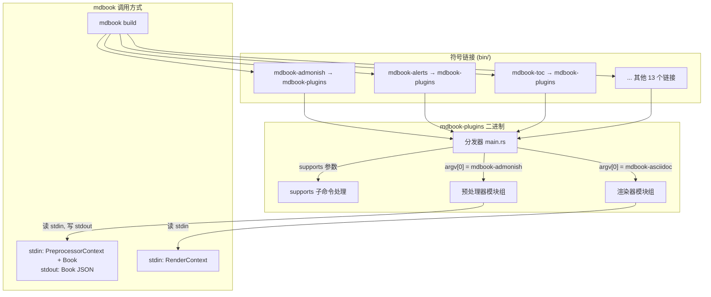
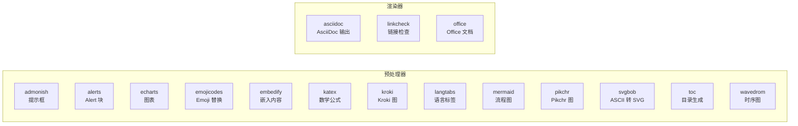
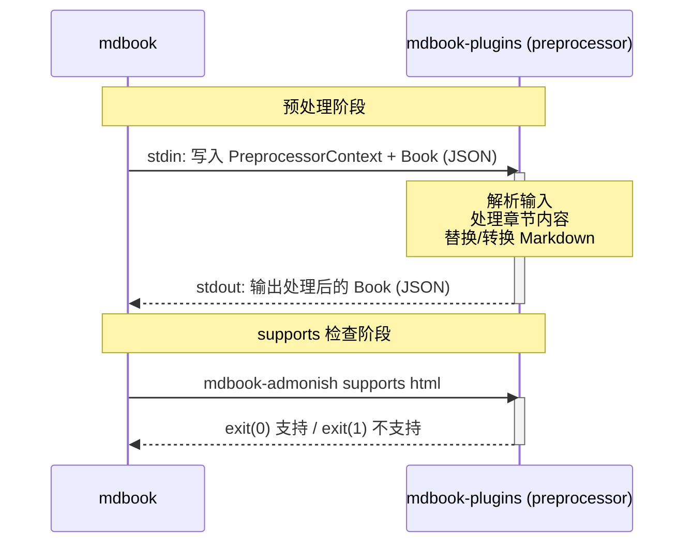

# 架构设计

## 整体架构

mdbook-plugins 采用**单二进制 + argv[0] 路由**架构。
所有插件代码编译进一个可执行文件，运行时通过程序名称自动分发到对应的处理逻辑。



## 分发机制

### argv[0] 路由

当 mdbook 调用 `mdbook-admonish` 时，操作系统通过符号链接执行 `mdbook-plugins`。
Rust 程序读取 `std::env::args().next()` 获取调用路径，提取文件名作为插件名。

```rust
// main.rs 核心逻辑（简化）
fn main() {
    let bin_name = std::env::args().next()
        .map(|p| Path::new(&p).file_stem().unwrap_or_default())
        .unwrap_or_default();

    let plugin_name = std::env::args().nth(1)
        .filter(|a| a.starts_with("mdbook-"))
        .unwrap_or(bin_name);

    run_plugin(&plugin_name, &args);
}
```

### 参数传递规则

| 场景 | argv[0] | argv[1] | 行为 |
|------|---------|---------|------|
| 正常预处理 | `mdbook-toc` | — | 路由到 toc 模块 |
| supports 检查 | `mdbook-toc` | `supports html` | 路由到 toc 的 supports 处理 |
| 显式指定插件 | `./mdbook-plugins` | `mdbook-toc` | 用 argv[1] 覆盖 argv[0] |

### 预处理器分类



## 模块结构

```
src/
├── main.rs                  # 分发器入口
├── lib.rs                   # 库根 + 插件注册表
├── utils.rs                 # 共享工具函数
├── preprocessors/
│   ├── mod.rs               # 13 个预处理器模块索引
│   ├── admonish.rs          # Admonition
│   ├── alerts.rs            # GitHub Alerts
│   ├── echarts.rs           # ECharts
│   ├── embedify.rs          # 嵌入内容
│   ├── emojicodes.rs        # Emoji
│   ├── katex.rs             # KaTeX
│   ├── kroki.rs             # Kroki
│   ├── langtabs.rs          # 语言标签
│   ├── mermaid.rs           # Mermaid
│   ├── pikchr.rs            # Pikchr（C FFI）
│   ├── svgbob.rs            # Svgbob
│   ├── toc.rs               # 目录
│   └── wavedrom.rs          # WaveDrom
└── renderers/
    ├── mod.rs               # 3 个渲染器模块索引
    ├── asciidoc.rs           # AsciiDoc
    ├── linkcheck.rs          # 链接检查
    └── office.rs             # Office 文档
```

### 模块接口约定

每个预处理器模块导出：

```rust
/// 标准入口函数（无参数，从 stdin 读，向 stdout 写）
pub fn run() -> anyhow::Result<()>;

/// 插件主体（实现 Preprocessor trait）
pub struct XxxPreprocessor;
impl mdbook::preprocess::Preprocessor for XxxPreprocessor { ... }
```

每个渲染器模块导出：

```rust
/// 标准入口函数
pub fn run() -> anyhow::Result<()>;
```

## 预处理协议

mdbook 预处理器通过 stdin/stdout 与 mdbook 通信：



### Preprocessor trait

```rust
pub trait Preprocessor {
    /// 插件名称
    fn name(&self) -> &str;

    /// 检查是否支持某渲染器
    fn supports_renderer(&self, renderer: &str) -> bool;

    /// 核心处理逻辑
    fn run(&self, ctx: &PreprocessorContext, book: Book) -> Result<Book, Error>;
}
```

## 渲染协议

渲染器同样通过 stdin 接收 `RenderContext`，处理结果写入文件系统：

```rust
pub trait Renderer {
    fn name(&self) -> &str;
    fn render(&self, ctx: &RenderContext) -> Result<(), Error>;
}
```

### 共享工具函数

`src/utils.rs` 提供了标准入口封装，减少模板代码：

```rust
/// 预处理器标准入口
pub fn run_preprocessor<P: Preprocessor>(pre: &P) -> anyhow::Result<()> {
    let (ctx, book) = CmdPreprocessor::parse_input(std::io::stdin())?;
    // 版本兼容性检查...
    let processed = pre.run(&ctx, book)?;
    serde_json::to_writer(std::io::stdout(), &processed)?;
    Ok(())
}

/// 渲染器标准入口
pub fn run_renderer<R: Renderer>(renderer: &R) -> anyhow::Result<()> {
    let ctx = RenderContext::from_json(std::io::stdin())?;
    renderer.render(&ctx)?;
    Ok(())
}
```
