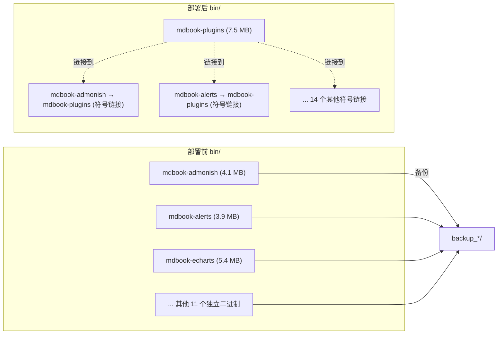

# 部署指南

## 构建发布

### 标准构建

```bash
cd /home/kuanghl/workspace/rpp/repo/mdbook-plugins

# Release 构建（推荐）
cargo build --release

# 产物
ls -lh target/release/mdbook-plugins
# -rwxr-xr-x 7.5M mdbook-plugins
```

Release 构建默认启用：
- **LTO**（链接时优化）
- **Strip**（去除调试符号）
- **Codegen-units=1**（最大单单元优化）

### 选择性构建

```bash
# 仅预处理器（无渲染器）
cargo build --release --no-default-features \
    --features "pre-alerts pre-emojicodes pre-toc pre-echarts pre-langtabs \
                pre-mermaid pre-katex pre-admonish pre-svgbob pre-pikchr \
                pre-kroki pre-embedify pre-wavedrom"

# 仅渲染器
cargo build --release --no-default-features \
    --features "ren-asciidoc ren-linkcheck ren-office"

# 最小构建（仅 mdbook-toc）
cargo build --release --no-default-features --features "pre-toc"
```

### 交叉编译

```bash
# 为 ARM64 平台交叉编译（需要安装目标工具链）
rustup target add aarch64-unknown-linux-gnu
cargo build --release --target aarch64-unknown-linux-gnu
```

## 部署步骤

### 完整部署脚本

```bash
#!/bin/bash
# deploy.sh — 部署 mdbook-plugins 到 mdbook-demo

set -e

REPO_DIR="/home/kuanghl/workspace/rpp/repo"
PLUGIN_DIR="$REPO_DIR/mdbook-plugins"
DEMO_DIR="$REPO_DIR/mdbook-demo"
BIN_DIR="$DEMO_DIR/bin"

echo "=== 构建 mdbook-plugins ==="
cd "$PLUGIN_DIR"
cargo build --release

echo "=== 复制二进制 ==="
cp target/release/mdbook-plugins "$BIN_DIR/"

echo "=== 备份原独立二进制 ==="
BACKUP_DIR="$BIN_DIR/backup_$(date +%Y%m%d_%H%M%S)"
mkdir -p "$BACKUP_DIR"

echo "=== 创建符号链接 ==="
for name in \
    mdbook-admonish mdbook-alerts mdbook-echarts mdbook-emojicodes \
    mdbook-embedify mdbook-katex mdbook-kroki-preprocessor \
    mdbook-langtabs mdbook-mermaid mdbook-pikchr mdbook-svgbob \
    mdbook-toc mdbook-wavedrom-rs \
    mdbook-asciidoc mdbook-linkcheck mdbook-office; do
    if [ -f "$BIN_DIR/$name" ] && [ ! -L "$BIN_DIR/$name" ]; then
        mv "$BIN_DIR/$name" "$BACKUP_DIR/"
    fi
    ln -sf mdbook-plugins "$BIN_DIR/$name"
done

echo "=== 部署完成 ==="
echo "备份: $BACKUP_DIR"
echo "二进制: $(ls -lh $BIN_DIR/mdbook-plugins | awk '{print $5}')"
```

### 部署文件变更清单



## 验证

### 快速检查

```bash
cd /home/kuanghl/workspace/rpp/repo/mdbook-demo

# 1. 检查符号链接
ls -la bin/mdbook-admonish
# 应输出: lrwxrwxrwx ... mdbook-admonish -> mdbook-plugins

# 2. 检查 supports 协议
PATH="./bin:$PATH" mdbook-admonish supports html
echo "退出码: $?"   # 应为 0

PATH="./bin:$PATH" mdbook-admonish supports not-supported
echo "退出码: $?"   # 应为 1

# 3. 测试路由
echo '{"sections":[]}' | PATH="./bin:$PATH" mdbook-toc 2>/dev/null
# 不应输出错误信息
```

### 完整构建测试

```bash
cd /home/kuanghl/workspace/rpp/repo/mdbook-demo

# 仅 HTML 输出（跳过 PDF，速度更快）
# 临时注释 book.toml 中的 [output.pdf]
PATH="./bin:$PATH" mdbook build

# 检查输出
ls books/index.html

# 检查插件是否生效
grep -c "mdbook-admonish" books/index.html
grep -c "mdbook-alerts" books/index.html
```

## 回滚

```bash
cd /home/kuanghl/workspace/rpp/repo/mdbook-demo/bin

# 1. 找到最近的备份
ls -d backup_*

# 2. 恢复所有原始二进制
BACKUP="backup_20260717_112437"  # 替换为实际备份目录

for file in "$BACKUP"/mdbook-*; do
    name=$(basename "$file")
    rm -f "$name"          # 删除符号链接
    cp "$file" "$name"     # 恢复原始二进制
    chmod +x "$name"
done

# 3. 删除合并二进制
rm -f mdbook-plugins

# 4. 验证恢复
ls -la mdbook-admonish
# 应输出: -rwxr-xr-x ... mdbook-admonish (不再是符号链接)
```

## book.toml 配置示例

```toml
[book]
title = "我的文档"
authors = ["作者"]

[build]
create-missing = true
use-default-preprocessors = false

# ===== 预处理器 =====
[preprocessor.alerts]

[preprocessor.emojicodes]

[preprocessor.toc]
command = "mdbook-toc"
renderer = ["html"]

[preprocessor.katex]
after = ["links"]

[preprocessor.admonish]
command = "mdbook-admonish"

[preprocessor.mermaid]
command = "mdbook-mermaid"

[preprocessor.echarts]
after = ["katex"]

# ===== 渲染器 =====
[output.html]
additional-css = ["./theme/mdbook-admonish.css"]
additional-js = [
    "./assets/mermaid/mermaid.min.js",
    "./assets/echarts/echarts.min.js",
]

[output.office]
formats = ["docx", "xlsx", "pptx"]
```

## 注意事项

1. **PATH 设置**：mdbook 通过 PATH 查找插件二进制，需确保 `bin/` 目录在 PATH 中
2. **PDF 渲染**：`mdbook-pdf` 已合并为轻量版（`ren-pdf`），依赖系统安装 Chrome/Chromium
3. **权限**：符号链接需要可执行权限，`ln -sf` 创建的链接继承目标文件权限
4. **版本兼容**：项目针对 mdbook 0.4.x 系列开发，如使用 mdbook 0.5+ 需调整 API 调用
