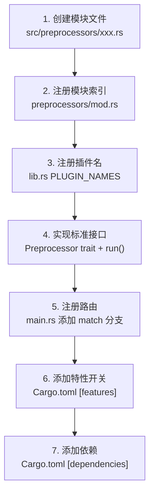

# 开发者指南

## 环境准备

| 工具 | 版本要求 | 用途 |
|------|---------|------|
| Rust | >= 1.76 (edition 2021) | 编译所有 Rust 代码 |
| Cargo | >= 1.76 | 包管理 |
| C 编译器（gcc/clang）| 任意 | 编译 pikchr.c |

```bash
# 安装 Rust（若未安装）
curl --proto '=https' --tlsv1.2 -sSf https://sh.rustup.rs | sh

# 安装 C 编译器（Ubuntu/Debian）
sudo apt install build-essential

# 验证
rustc --version
cargo --version
cc --version
```

## 构建命令

```bash
cd /home/kuanghl/workspace/rpp/repo/mdbook-plugins

# 开发构建（快速迭代，~133 MB）
cargo build

# 发布构建（LTO + strip，~7.5 MB）
cargo build --release

# 选择性编译（只编译需要的插件）
cargo build --release --no-default-features \
    --features "pre-alerts pre-toc pre-mermaid"

# 编译单个渲染器
cargo build --release --no-default-features --features "ren-office"

# 查看所有特性
cargo metadata --no-deps --format-version 1 | jq '.packages[0].features'
```

## 添加新插件

### 步骤概览



### 详细步骤

#### 步骤 1：创建模块文件

在 `src/preprocessors/`（预处理器）或 `src/renderers/`（渲染器）下创建 `.rs` 文件。

预处理器模板：

```rust
//! src/preprocessors/my_plugin.rs

use mdbook::book::{Book, BookItem};
use mdbook::errors::Error;
use mdbook::preprocess::{Preprocessor, PreprocessorContext};

pub struct MyPreprocessor;

impl Preprocessor for MyPreprocessor {
    fn name(&self) -> &str {
        "mdbook-my-plugin"
    }

    fn supports_renderer(&self, renderer: &str) -> bool {
        renderer != "not-supported"
    }

    fn run(&self, _ctx: &PreprocessorContext, mut book: Book) -> Result<Book, Error> {
        // 遍历所有章节
        book.for_each_mut(|item: &mut BookItem| {
            if let BookItem::Chapter(ref mut chapter) = item {
                // 在这里处理 chapter.content
                chapter.content = transform_content(&chapter.content);
            }
        });
        Ok(book)
    }
}

fn transform_content(content: &str) -> String {
    // 具体的转换逻辑
    content.to_string()
}

/// 标准入口
pub fn run() -> anyhow::Result<()> {
    crate::utils::run_preprocessor(&MyPreprocessor)
}
```

渲染器模板：

```rust
//! src/renderers/my_renderer.rs

use mdbook::errors::Error;
use mdbook::renderer::{RenderContext, Renderer};

pub struct MyRenderer;

impl Renderer for MyRenderer {
    fn name(&self) -> &str { "my-renderer" }

    fn render(&self, ctx: &RenderContext) -> Result<(), Error> {
        let book = &ctx.book;
        let dest = &ctx.destination;
        // 渲染逻辑...
        Ok(())
    }
}

pub fn run() -> anyhow::Result<()> {
    crate::utils::run_renderer(&MyRenderer)
}
```

#### 步骤 2：注册模块索引

在 `src/preprocessors/mod.rs` 中添加：

```rust
pub mod my_plugin;
```

#### 步骤 3：注册插件名

在 `src/lib.rs` 的 `PLUGIN_NAMES` 数组中添加：

```rust
pub const PLUGIN_NAMES: &[&str] = &[
    // ... 现有插件 ...
    "mdbook-my-plugin",
];
```

#### 步骤 4：实现标准接口

确保实现了 `Preprocessor` trait 或 `Renderer` trait，
并导出 `pub fn run()` 函数。

#### 步骤 5：注册路由

在 `src/main.rs` 的 `run_plugin()` 函数中添加：

```rust
// 在预处理器列表中
"mdbook-pikchr" | "mdbook-svgbob" | "mdbook-my-plugin"

// 在正常执行匹配中
"mdbook-my-plugin" => mdbook_plugins::preprocessors::my_plugin::run(),
```

如果需要在 `supports` 处理中也添加，在 Box 匹配中：

```rust
"mdbook-my-plugin" => Box::new(mdbook_plugins::preprocessors::my_plugin::MyPreprocessor),
```

#### 步骤 6：添加特性开关

在 `Cargo.toml` 的 `[features]` 中添加：

```toml
[features]
all = [
    # ... 现有特性 ...
    "pre-my-plugin",
]
pre-my-plugin = []
```

#### 步骤 7：添加依赖

如果新插件需要额外的 crate，添加到 `[dependencies]` 中：

```toml
[dependencies]
# 我的插件
my-crate = "1.0"
```

## 代码规范

### 导入顺序

```rust
// 1. 标准库
use std::path::Path;

// 2. 第三方 crate
use mdbook::book::{Book, BookItem};
use pulldown_cmark::{Event, Parser};

// 3. 项目内部
use crate::utils;
```

### 错误处理

- 所有 `run()` 函数返回 `anyhow::Result<()>`
- `Preprocessor::run()` 返回 `Result<Book, mdbook::errors::Error>`
- 使用 `log::warn!` / `log::error!` 记录问题，避免 panic
- 内部处理 `for_each_mut` 闭包中的错误时使用 `Option<Error>` 模式

### 代码块处理（重要）

由于 Rust `regex` crate **不支持** lookahead/lookbehind 和反向引用，
处理 Markdown 代码块时优先使用 `pulldown-cmark` crate 进行 AST 解析，
而不是正则表达式。

```rust
// ✅ 推荐：使用 pulldown-cmark 解析
let parser = Parser::new(content);
for event in parser {
    match event {
        Event::Start(Tag::CodeBlock(kind)) => {
            let info = match &kind {
                CodeBlockKind::Fenced(s) => s.to_string(),
                CodeBlockKind::Indented => String::new(),
            };
            // ...
        }
        // ...
    }
}

// ❌ 避免：正则处理代码块（不支持反向引用 \1）
```

### 嵌入式资源

小的 CSS/模板文件使用 `include_str!` 内嵌（从 `assets/` 目录）：

```rust
const STYLE_CSS: &str = include_str!("../../assets/alerts/style.css");
```

C 源代码放在 `vendor/` 目录，通过 `build.rs` 编译。

## 调试技巧

### 启用日志输出

```bash
# 设置日志级别为 debug
RUST_LOG=debug ./bin/mdbook-admonish < input.json

# 只查看特定插件的日志
RUST_LOG=mdbook_plugins=debug ./bin/mdbook build
```

### 单独测试预处理

```bash
# 生成测试输入
cd /home/kuanghl/workspace/rpp/repo/mdbook-demo
PATH="./bin:$PATH" mdbook build --renderer json 2>/dev/null | head -c 1000 > /tmp/test_input.json

# 或者直接用小输入测试
echo '{"sections":[{"Chapter":{"name":"test","content":"# Hello\n> [!NOTE]\n> Test"}}]}' | \
    PATH="./bin:$PATH" mdbook-alerts 2>/dev/null
```

### 使用 supports 检查

```bash
# 检查插件是否正确识别
PATH="./bin:$PATH" mdbook-admonish supports html
echo $?   # 0 = 支持

PATH="./bin:$PATH" mdbook-admonish supports not-supported
echo $?   # 1 = 不支持
```

### 完整构建测试（无 PDF）

```bash
cd /home/kuanghl/workspace/rpp/repo/mdbook-demo
# 临时注释 book.toml 中 [output.pdf] 部分
PATH="./bin:$PATH" mdbook build
```

## 核心实现模式

### pulldown-cmark 事件遍历模式

本项目大量使用 `pulldown-cmark` 解析 Markdown。理解其事件模型是维护的基础。

**事件流示例**（以 `# Hello **world**` 为例）：

```
Start(Heading(H1, ...))
  Text("Hello ")
  Start(Emphasis)
    Text("world")
  End(Emphasis)
End(Heading)
```

**代码块识别**：`Tag::CodeBlock(kind)` 的 `kind` 有两种变体：

```rust
enum CodeBlockKind<'a> {
    Indented,           // 缩进代码块（4 空格）
    Fenced(CowStr<'a>), // 围栏代码块，包含语言标识，如 "rust"
}
```

**状态机模式**：处理 fenced code block 时用布尔标志跟踪状态：

```rust
let mut in_block = false;
let mut block_content = String::new();

for event in parser {
    match event {
        Event::Start(Tag::CodeBlock(kind)) => {
            if kind == "mermaid" {  // 只处理特定类型
                in_block = true;
                block_content.clear();
                continue;           // 跳过原样输出
            }
            // 非目标代码块，让后续代码正常输出
        }
        Event::End(TagEnd::CodeBlock) => {
            if in_block {
                in_block = false;
                // 将 block_content 替换为渲染后的 HTML
                output.push_str(&render(block_content));
                continue;
            }
        }
        Event::Text(text) => {
            if in_block {
                block_content.push_str(&text);
            } else {
                output.push_str(&text);
            }
        }
        // ... 其他事件原样传递
    }
}
```

### for_each_mut 错误处理模式

`book.for_each_mut()` 的闭包签名是 `FnMut(&mut BookItem)`，不返回 `Result`。
因此内部不能使用 `?` 运算符。标准处理模式：

```rust
fn run(&self, _ctx: &PreprocessorContext, mut book: Book) -> Result<Book, Error> {
    let mut error: Option<Error> = None;  // ⚠️ 必须在闭包外定义
    book.for_each_mut(|item: &mut BookItem| {
        if error.is_some() {
            return;  // 已有错误，跳过后续处理
        }
        if let BookItem::Chapter(ref mut chapter) = *item {
            match process_chapter(&chapter.content) {
                Ok(content) => chapter.content = content,
                Err(e) => error = Some(e.into()),  // 转换为 mdbook::Error
            }
        }
    });
    error.map_or(Ok(book), Err)  // 有错误则返回，无错误返回 book
}
```

### mdbook-preprocessor vs mdbook crate

历史原因，项目的依赖包含两个 mdbook 相关 crate：

| Crate | 用途 | 使用场景 |
|-------|------|---------|
| `mdbook = "0.4"` | 完整 mdbook API | `CmdPreprocessor::parse_input()`、`Preprocessor` trait、`Book` 类型 |
| `mdbook-preprocessor = "0.5"` | 精简版预处理器 API | 部分插件引用 `mdbook_preprocessor` 类型 |
| `mdbook-renderer = "0.5"` | 渲染器 API | `RenderContext`、`Renderer` trait |

**注意**：`mdbook 0.4` 和 `mdbook-preprocessor 0.5` 是兼容的，但类型不完全相同。
在 `utils.rs` 中使用的是 `mdbook` crate 的类型。

### MDBOOK_VERSION 警告说明

构建时看到的版本警告是正常现象：

```
Warning: mdbook-admonish was built against mdbook v0.4.52, but running with v0.4.36
```

这是因为 `mdbook 0.4` crate 有自己的 `MDBOOK_VERSION = "0.4.52"` 常量，
而实际运行的 `mdbook` 二进制可能是 0.4.36。这个警告**不影响功能**。

### 插件通信协议调试

mdbook 通过子进程调用插件，通信格式为 JSON（stdin/stdout）。
可以用以下方法调试：

```bash
# 1. 手动构造预处理输入并测试
echo '{
  "version": "0.4.36",
  "mdbook_version": "0.4.36",
  "preprocessor": {"alerts": {}},
  "book": {
    "sections": [{
      "Chapter": {
        "name": "test",
        "content": "# Test\n> [!NOTE]\n> Hello",
        "number": [1],
        "sub_items": [],
        "path": "test.md",
        "parent_names": []
      }
    }],
    "__non_exhaustive": null
  }
}' | RUST_LOG=debug ./bin/mdbook-alerts

# 2. 捕获 mdbook 实际发送的数据
cd /home/kuanghl/workspace/rpp/repo/mdbook-demo
RUST_LOG=trace PATH="./bin:$PATH" mdbook build 2>&1 | grep "preprocessor"
```

### 常见陷阱

1. **`regex` crate 不支持 lookahead/lookbehind** —
   如需要匹配 `$...$` 但不匹配 `$$...$$`，不能使用 `(?<![$])`。
   解决方案：手动字符流解析（参考 `katex.rs`）。

2. **`regex` crate 不支持反向引用 `\1`** —
   如需要匹配相同数量的开头/结尾反引号，不能使用 `` `{3,}...\1 ``。
   解决方案：使用 `pulldown-cmark` AST 解析（参考 `admonish.rs`）。

3. **`pulldown-cmark::CodeBlockKind` 不实现 `Display`** —
   不能直接 `kind.to_string()` 或 `format!("{}", kind)`。
   必须手动 match：
   ```rust
   let info = match &kind {
       CodeBlockKind::Fenced(s) => s.to_string(),
       CodeBlockKind::Indented => String::new(),
   };
   ```

4. **`RenderContext` 字段访问** —
   `mdbook` 0.4 的 `RenderContext` 直接暴露字段，而非通过 `ctx.ctx.book`：
   ```rust
   // ✅ 正确
   ctx.book, ctx.destination, ctx.config
   // ❌ 错误（来自 mdbook-renderer 0.5 的 RenderContext）
   ctx.ctx.book
   ```

5. **`ctx.config` 的类型** —
   `ctx.config` 是 `mdbook::config::Config`，其 `get()` 方法返回 `Option<&toml::Value>`，
   需要转换为 `serde_json::Value` 后再使用 `serde_json::from_value` 反序列化。

6. **`include_str!` 路径基准** —
   `include_str!` 的路径相对于当前源文件，而非项目根目录：
   ```rust
   // 文件位置: src/preprocessors/alerts.rs
   // 路径解析: src/preprocessors/../../assets/alerts/style.css
   //         = assets/alerts/style.css
   const STYLE: &str = include_str!("../../assets/alerts/style.css");
   ```

