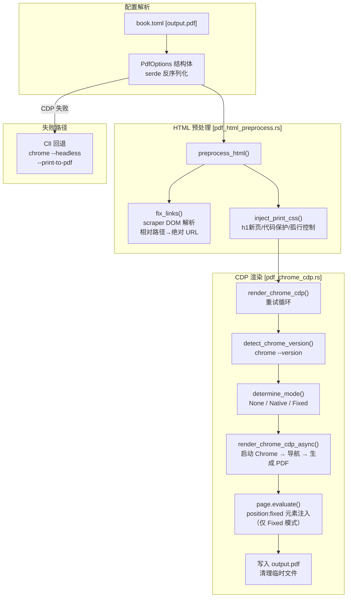

# PDF 渲染实现

## 概述

`mdbook-pdf` 通过 **Chrome DevTools Protocol (CDP)** 生成高质量 PDF，解决了页眉/页脚重叠、内容不当分页等核心痛点。渲染器由三个模块协同工作。

[基于 Chrome DevTools Protocol Page.printToPDF 的完整参数](https://chromedevtools.github.io/devtools-protocol/tot/Page/#method-printToPDF)

## 模块结构

```
src/renderers/
├── mod.rs                   # 模块声明
├── pdf.rs                   # PdfOptions 配置结构体 + CLI 后端
├── pdf_chrome_cdp.rs        # CDP 后端核心（双模式 + 版本检测 + 重试）
└── pdf_html_preprocess.rs   # HTML 预处理（链接修正 + 分页 CSS）
```

## 核心架构



## 配置参考

所有参数定义在 `book.toml` 的 `[output.pdf]` 段，全部可选，有合理默认值。

### 浏览器与重试

| 参数 | 类型 | 默认值 | 说明 |
|------|------|--------|------|
| `backend` | string | `"chrome"` | 后端选择：`"chrome"`（CDP→CLI 回退）或 `"chrome-cli"`（强制 CLI） |
| `browser-binary-path` | string | `""` | Chrome/Chromium 路径，留空自动探测。环境变量 `CHROME` 优先 |
| `trying-times` | u32 | `1` | CDP 失败重试次数，每次启动新 Chrome 实例 |

### 页面几何（单位：英寸）

| 参数 | 类型 | 默认值 | 说明 |
|------|------|--------|------|
| `paper-width` | f64 | `8.5` | 纸张宽度。A4: `8.27` |
| `paper-height` | f64 | `11.0` | 纸张高度。A4: `11.69` |
| `landscape` | bool | `false` | 横向纸张 |
| `margin-top` | f64 | `1.0` | 上边距（英寸，≈2.54cm） |
| `margin-bottom` | f64 | `1.0` | 下边距 |
| `margin-left` | f64 | `1.0` | 左边距 |
| `margin-right` | f64 | `1.0` | 右边距 |
| `scale` | f64 | `1.0` | 全局缩放，`1.25` = 放大 125% |
| `prefer-css-page-size` | bool | `false` | 以 CSS `@page` 尺寸为准 |

### 页眉/页脚

| 参数 | 类型 | 默认值 | 说明 |
|------|------|--------|------|
| `no_header` | Option\<bool\> | `None` | `Some(true)` → 无条件禁用所有页眉/页脚。`None` 或 `Some(false)` → 跟随 `display-header-footer` |
| `display-header-footer` | bool | `false` | 是否启用页眉/页脚（被 `no_header=Some(true)` 覆盖） |
| `use-native-header-footer` | bool | `false` | `true` → CDP 原生模板（Chrome 125+）；`false` → CSS 固定定位注入 |
| `css-header-footer` | bool | `true` | CSS 注入独立开关。与 `use-native-header-footer` 正交，两者可独立启用/禁用，实现4种组合模式（见下文） |
| `header-height` | f64 | `0.7` | 固定定位模式：页眉占用英寸高度（用于 `@page margin-top` 补偿） |
| `footer-height` | f64 | `0.6` | 固定定位模式：页脚占用英寸高度 |
| `header-template` | string | `""` | HTML 模板。原生模式支持 `class='date/title/pageNumber/totalPages'` |
| `footer-template` | string | `""` | 同 `header-template` |

### 内容控制

| 参数 | 类型 | 默认值 | 说明 |
|------|------|--------|------|
| `print-background` | bool | `true` | 是否打印背景色/图 |
| `page-range` | string | `""` | 页码范围，如 `"1-5,8,11-13"` |
| `ignore-invalid-page-ranges` | bool | `false` | `true` → 无效时生成全部；`false` → 报错 |
| `generate-document-outline` | bool | `true` | PDF 书签大纲 |
| `generate-tagged-pdf` | bool | `true` | 带标签的 PDF（无障碍支持） |

### 链接修复

| 参数 | 类型 | 默认值 | 说明 |
|------|------|--------|------|
| `static-site-url` | string | `""` | 书籍静态网站基准 URL，用于将相对链接转为绝对路径 |

## 页眉/页脚双模式

### 模式选择逻辑

```
┌─ header_footer_enabled() = false? ──→ None 模式
│   (no_header=true 或 display-header-footer=false)
│
├─ css-header-footer = true?
│   │
│   └─ CSS 注入模式（与下方 CDP 模式可共存）
│         ├── position:fixed CSS 注入
│         ├── @page margin = 用户值 + header/footer-height（补偿）
│         └── pageNumber/totalPages 不支持（日志警告）
│
└─ use-native-header-footer = true?
    │
    ├─ Chrome >= 125? ──→ Native 模式（CDP 原生模板）
    │     ├── header_template / footer_template → CDP 原生渲染
    │     ├── @page margin = 用户原始值
    │     └── 支持 pageNumber, totalPages 动态类
    │
    ├─ Chrome < 125? ──→ Fixed 模式（自动降级 + 日志警告）
    │
    └─ use-native-header-footer = false ──→ Fixed 模式（默认）
          ├── position:fixed CSS 注入
          ├── @page margin = 用户值 + header/footer-height（补偿）
          ├── CDP margin = 0（完全由 CSS 控制）
          └── pageNumber/totalPages 不支持（日志警告）
```

### 四种组合模式

`css-header-footer` 与 `use-native-header-footer` 是**正交的独立开关**，组合实现4种模式：

| `use-native-header-footer` | `css-header-footer` | 效果 |
|---|---|---|
| `false`（默认） | `true`（默认） | **仅 CSS 注入** |
| `false` | `false` | **无页眉/页脚** |
| `true` | `true` | **CDP 原生 + CSS 注入**（叠加显示） |
| `true` | `false` | **仅 CDP 原生** |

**注意**：当 `use-native-header-footer=true` 时，某些 Chrome 版本（如 v150）存在 `displayHeaderFooter` 参数被忽略的 bug，会导致 Chrome **默认页眉/页脚**与自定义模板同时渲染，产生意料之外的双页眉/页脚。如果遇到此问题，建议：
- 升级或降级 Chrome 至稳定版本
- 或改用纯 CSS 注入模式（`use-native-header-footer=false` + `css-header-footer=true`）

### Native 模式实现

```rust
// CDP 参数：原生页眉/页脚由 Chrome 内部渲染
PrintToPdfParams {
    display_header_footer: Some(true),
    header_template: Some(header_html),
    footer_template: Some(footer_html),
    margin_top: Some(user_margin),  // 直接使用用户值
    margin_bottom: Some(user_margin),
    // ...
}
```

**优点**：`pageNumber`/`totalPages` 完美支持，无需人工计算高度，不会与正文流干扰。

### Fixed 模式实现

**边距补偿公式**：
```
@page margin-top    = 用户 margin-top  + header_height
@page margin-bottom = 用户 margin-bottom + footer_height
CDP margin_top/margin_bottom = 0.0 (由 CSS 全权控制)
```

**注入的 CSS**：
```css
.pf-header, .pf-footer { display: none; }
@media print {
  .pf-header, .pf-footer {
    display: block; position: fixed;
    left: 0; right: 0; width: 100%;
    overflow: hidden; box-sizing: border-box;
    z-index: 10000; background: #fff;
  }
  .pf-header { top: 0; height: 0.7in; }
  .pf-footer { bottom: 0; height: 0.6in; }
}
```

**模板占位符替换**（JS 端 `page.evaluate()` 执行）：

通过 JavaScript `fillTemplate` 函数同时支持两种语法：
- `{{date}}` / `{{title}}`（自定义占位符）
- `<span class='date'></span>` / `<span class="title"></span>`（CDP 原生类语法）

动态值来源：
- `document.title` → 标题
- `new Date().toISOString().split('T')[0]` → 当前日期

## HTML 预处理

### 链接修正

使用 `scraper` crate 解析 DOM，只处理 `<a href="...">`：

```
fix_single_link(href, base_url)
  ├─ http:// / https:// / mailto: / tel: → 跳过（绝对链接）
  ├─ # / javascript: / // → 跳过（锚点/协议相对）
  ├─ / → 跳过（根路径）
  └─ 其他 → 拼接 base_url + href
```

### 分页保护 CSS

```css
@media print {
  h1, h2, h3, h4, h5, h6 { page-break-after: avoid; }
  h1 { page-break-before: always; }
  h2, h3 { page-break-before: avoid; }
  pre, code, table, figure, img, svg { page-break-inside: avoid; }
  .mermaid, .echarts { page-break-inside: avoid; }
  p, li { widows: 2; orphans: 2; }
}
```

## 错误处理与重试

```rust
for attempt in 1..=max_attempts {
    match render_chrome_cdp_async(...).await {
        Ok(()) => return Ok(()),
        Err(e) if attempt < max_attempts => {
            // sleep 500ms, 重启 Chrome
        }
        Err(e) => return Err(e),
    }
}
```

- 临时文件 `print_pdf.html` 只写一次，重试间复用
- 每次重试新建 `Browser` 实例，避免残留状态
- 最终清理临时文件（成功或所有重试失败后）

## CDP 参数构造

### 原生模式

```rust
fn build_params_native(cfg: &PdfOptions) -> PrintToPdfParams {
    PrintToPdfParams {
        display_header_footer: Some(true),
        header_template: Some(cfg.header_template.clone()),
        footer_template: Some(cfg.footer_template.clone()),
        margin_top: Some(cfg.margin_top),
        margin_bottom: Some(cfg.margin_bottom),
        // ... paper_width, paper_height, scale, page_ranges 等
        generate_document_outline: Some(cfg.generate_document_outline),
        generate_tagged_pdf: Some(cfg.generate_tagged_pdf),
    }
}
```

### 固定定位模式

```rust
fn build_params_fixed(cfg: &PdfOptions) -> PrintToPdfParams {
    PrintToPdfParams {
        display_header_footer: Some(false),
        margin_top: Some(0.0),  // 由 @page CSS 控制
        margin_bottom: Some(0.0),
        // ... 其余参数同原生模式
    }
}
```

## Chrome 版本检测

通过 CLI 调用 `chrome --version` 获取版本号：

```
"Google Chrome 126.0.6478.56"  →  Version { major: 126, minor: 0, patch: 6478 }
"Chromium 130.0.6723.58"       →  Version { major: 130, minor: 0, patch: 6723 }
```

使用 `semver::Version` 解析。搜索顺序：
1. 环境变量 `CHROME`
2. `book.toml` 的 `browser-binary-path`
3. PATH 搜索：`google-chrome-stable` → `chromium-browser` → `chromium`

## CLI 后端

当 CDP 后端不可用或设置为 `backend = "chrome-cli"` 时，使用 `chrome --headless --print-to-pdf`：

```bash
google-chrome --headless --no-sandbox \
  --print-to-pdf=output.pdf \
  --print-to-pdf-no-header=true \
  print_pdf.html
```

CLI 模式不处理页眉/页脚 HTML 注入（由 Chrome 的 `--print-to-pdf-no-header` 控制）。

## 测试验证

### 单元测试

| 测试文件 | 用例数 | 覆盖内容 |
|---------|--------|---------|
| `pdf_html_preprocess::tests` | 9 | 链接修正（6 用例）、CSS 注入（2 用例）、完整流水线（1 用例） |
| `pdf_chrome_cdp::tests` | 14 | 模式选择（5）、参数构造（2）、JS 注入（2）、版本提取（3）、启用判断（2） |

### 集成测试

通过 `test/verify.sh` + `test/book.toml` 执行 `mdbook build` 端到端验证。

## 调试建议

1. 设置 `RUST_LOG=debug mdbook build` 查看详细 CDP 日志
2. 遇到页眉重叠时调整 `header-height` / `footer-height` 参数
3. 若需要页码，设置 `use-native-header-footer = true`（需 Chrome 125+）
4. 若 Chrome 启动超时，检查 `--no-sandbox` 和 `browser-binary-path`
